# Mechatronics Engineering Bachelor's Degree Projects

This repository contains the projects I worked on during my bachelor's degree in Mechatronics Engineering.

## First Year

### Bridge Structure Project

As a beginner student, my group and I created a bridge structure to carry more than 20 kilograms. The project aimed to elevate the load from the middle of the bridge. We successfully constructed the project and tested its load-bearing capacity, eventually winning the first-class award in mechatronics engineering.

  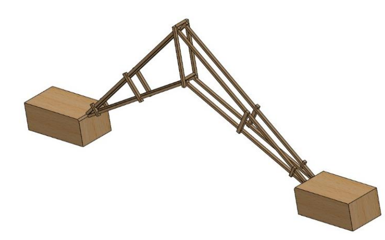
  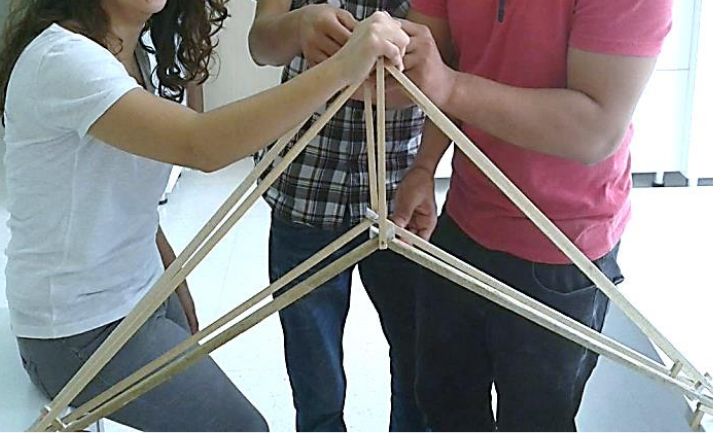

*Note: This project was based on a static university course.*

## Second Year

### Projectile Motion Project

In the dynamic course, we undertook a projectile motion project where we had to prove hitting a specified target using theoretical calculations. The project involved the use of aerodynamic elements such as springs, nails, and aluminum.

  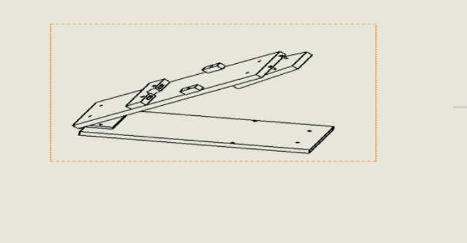
  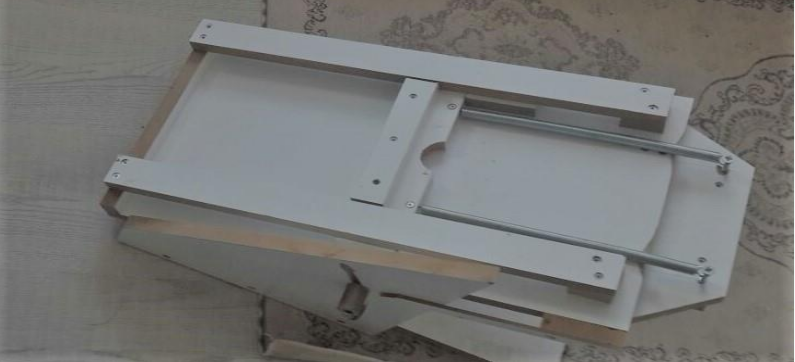

*Note: This project was based on a dynamic university course.*

## Third Year

### Mechatronics Projects

1. **Reading and Measuring Displacement**: Reading and measuring linear and angular displacement from a potentiometer, displaying readings on the Arduino serial port with small accuracy and precision.

2. **Automobile Obstacle Avoidance**: Investigated sensing properties using sensors like temperature, ultrasonic, LDR, and Bluetooth module for an adjustable automobile obstacle avoidance system.

  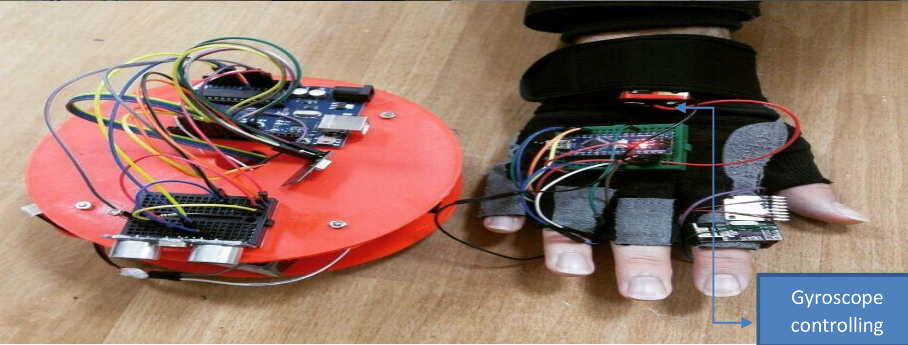

3. **Garage Automatic Gate**: Constructed an automatic gate using sensing properties to open automatically when an object approached.

4. **Flying Robot**: Designed a flying robot controlled online via a Bluetooth module.

  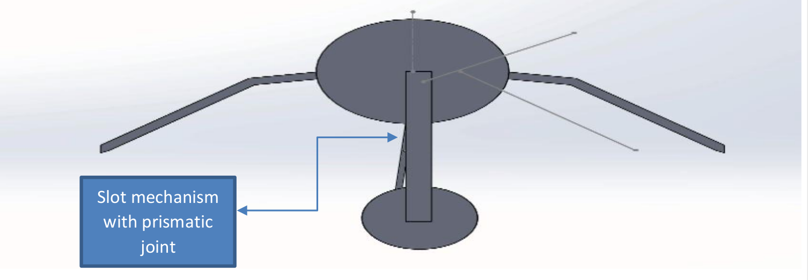

5. **Steering System**: Constructed a mobile robot with a steering system using a four-bar mechanism.

  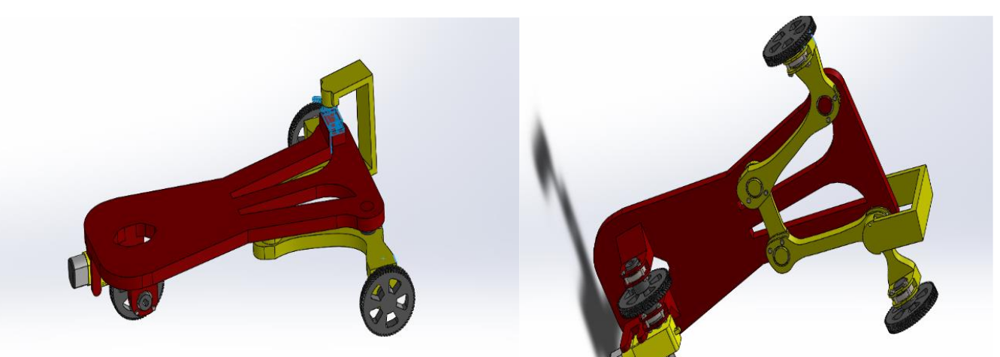

*Note: These projects were based on sensor and systems, theory of machine, mechatronic system design, machine elements, and electrical machines university courses.*

## Fourth Year

### First Project: PLC Controlling

**Industrial Automation Course**

Modified AC motor controlling using analog and digital sensors to control motor speed based on task requirements. Used Arduino microcontroller and Python interface for real-time monitoring.

  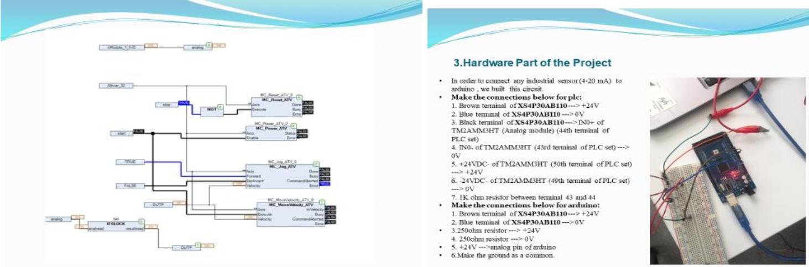

### Engineering Design and Problem Solving

A valuable course teaching problem-solving methods applied at Stanford University, emphasizing real-life applications.

### Image Processing and Raspberry Pi

Applied image processing using Raspberry Pi for tasks like obstacle avoidance and designing a home smart alarm system.

  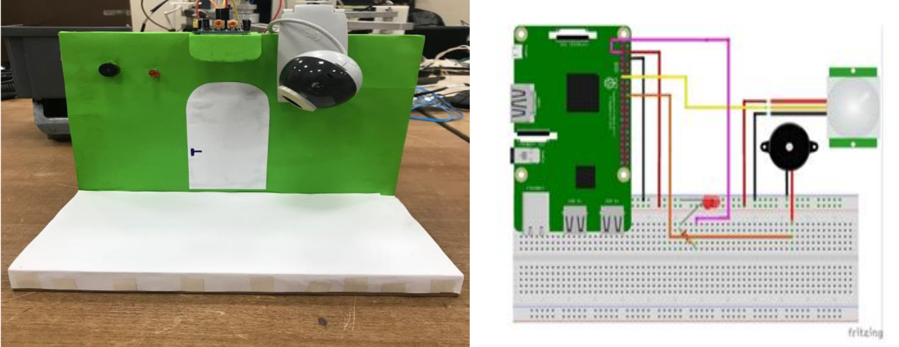

### Designing a Hydroponic System

Designed parameters for a hydroponic plant system, incorporating light control and other necessary elements.

### Graduation Project: Modifying a SCARA Robot Manipulator

Designed an attachable and detachable reconfigurable serial robot manipulator for industrial, medical, manufacturing, and planting applications.

  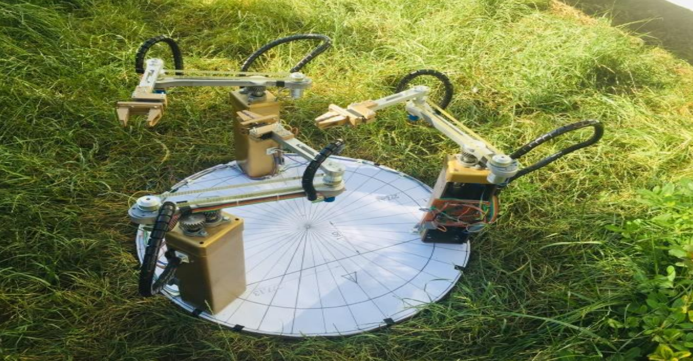

### Designing CNC Machine

Designed a CNC machine for various industrial operations like welding, drawing, and laser cutting, saving costs compared to market alternatives.

  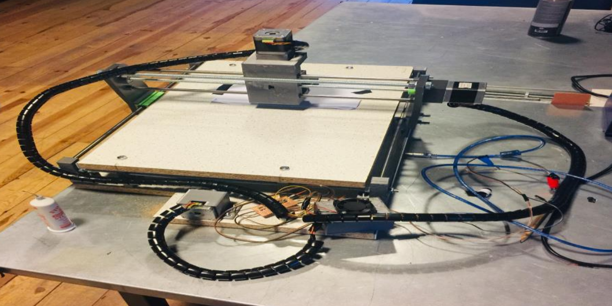

### Designing 6DoF Serial Robot Manipulator

Designed a 6DoF serial robot manipulator for industrial purposes, using NEMA 17 servo motors.

  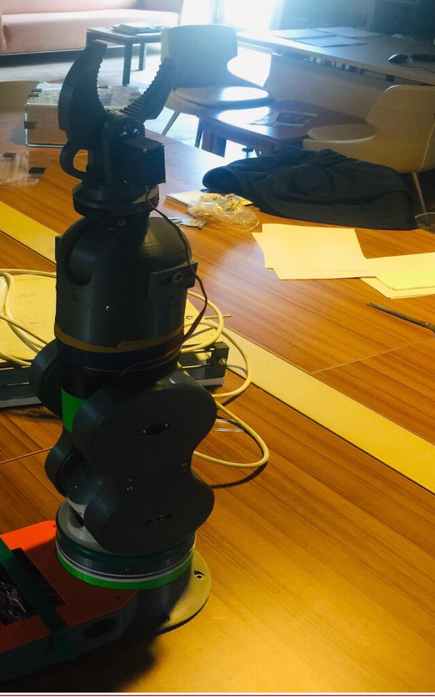

## Contact Information

- **Email:** basheeraltaweel@gmail.com

